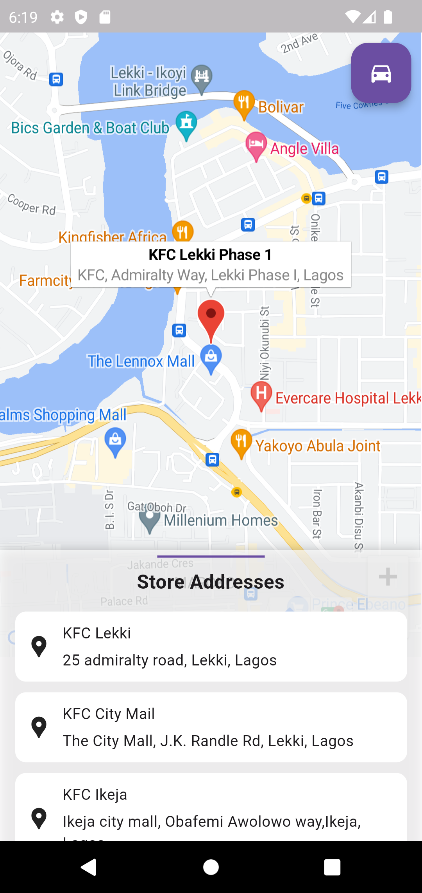

### Introduction

In our previous blog post, we discussed how to create a Store Locator API using Laravel and Swagger documentation. Now, it's time to build a Flutter app that leverages this API to display store locations on Google Maps. In this tutorial, we'll walk you through the steps to create a Store Locator app with Flutter.

### Prerequisites

Before we begin, make sure you have the following:

- Flutter development environment set up.
- The Store Locator API created in our previous blog post.
- Access to Google Maps API credentials.

## Getting Started

### 1. Create a New Flutter Project

Let's start by creating a new Flutter project:

```bash
flutter create store_locator_app
```

```bash
cd store_locator_app
```

### 2. Add Dependencies

- In your pubspec.yaml file, add the following dependencies:

```bash
dependencies:
  flutter:
    sdk: flutter
  google_maps_flutter: ^2.5.0
  http: ^1.1.0
  sliding_up_panel: ^2.0.0+1
  geolocator: ^8.0.1
  url_launcher: ^6.1.6
```

- Then, run flutter pub get to fetch the dependencies.

### 3. Set Up Google Maps

To display Google Maps in your app, you'll need to configure the Google Maps API. Follow the official documentation to obtain an API key: Google Maps Platform.

Once you have your API key, add it to your Android and iOS configuration files:

- Android: android/app/src/main/AndroidManifest.xml
- iOS: ios/Runner/Info.plist

### 4. Create the Store Locator Screen

In your lib directory, create a new Dart file, e.g., locator_screen.dart. This file will contain the code for your Store Locator screen.

### 5. Run the App

Now, you can run your Flutter app using flutter run. You should see the Store Locator screen with Google Maps displaying the store locations obtained from your API.

### Screenshot


